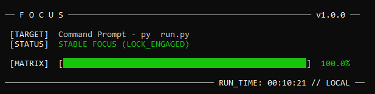

# focus

a minimalist, zero-telemetry window manager sniffer that runs locally in your terminal to map your real-time cognitive velocity.

## preview


## about the developer
heyyy! i'm a high school senior using this project to learn python, figure out how operating systems track active windows, and finally learn how to use github properly.

## why it exists
most productivity tools are web apps that hog memory, or background telemetry logging your data to an external server. 

`focus` runs entirely offline. it queries your host operating system's window manager once a second to see what you're looking at. if you're in an ide or terminal, your momentum builds. if you pull up a distraction, it recoils your score instantly.

## installation & launch

### first-time setup
If you are running the app for the very first time, copy and paste this command into your terminal to download the repository, install dependencies, and launch:

**windows:**
```cmd
git clone [https://github.com/riddhimasengar/focus.git](https://github.com/riddhimasengar/focus.git) && cd focus && py -m pip install -r requirements.txt && py run.py
```
**for mac / linux:**
```cmd
git clone [https://github.com/riddhimasengar/focus.git](https://github.com/riddhimasengar/focus.git) && cd focus && pip install -r requirements.txt && python3 run.py
```

## how to run it
once the app is already downloaded on your machine, do not run the clone command again (it will throw a destination path error). just open your terminal and run this to launch it instantly:

**windows:**
```cmd
cd focus && py run.py
```
**for mac / linux:**
```cmd
cd focus && python3 run.py
```
(just hit ctrl + c in your terminal to close it whenever you want).
